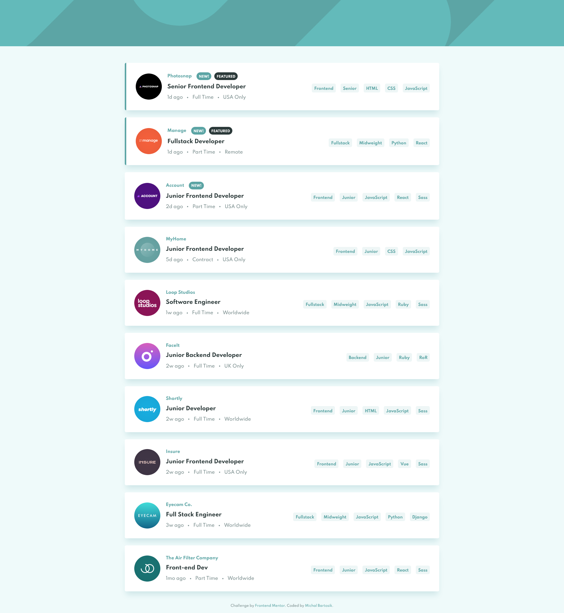

# Frontend Mentor - Job listings with filtering solution

This is a solution to the [Job listings with filtering challenge on Frontend Mentor](https://www.frontendmentor.io/challenges/job-listings-with-filtering-ivstIPCt). Frontend Mentor challenges help you improve your coding skills by building realistic projects.

## Table of contents

- [Overview](#overview)
  - [The challenge](#the-challenge)
  - [Screenshot](#screenshot)
  - [Links](#links)
- [My process](#my-process)
  - [Built with](#built-with)
  - [Useful resources](#useful-resources)
- [Setup](#setup)
- [Author](#author)

## Overview

### The challenge

Users should be able to:

- View the optimal layout for the site depending on their device's screen size
- See hover states for all interactive elements on the page
- Filter job listings based on the categories

### Screenshot



### Links

You can check Live Site URL [here](https://static-job-listings-mbart13.vercel.app/)

## My process

### Built with

- React
- Redux
- CSS modules
- Mobile-first workflow

To make this project more realistic, I decided to fetch jobs data from server. For this I created my own API using Vercel serverless function.

This is my first time with Redux, obviously I could have used Context API and hooks like in some projects before, but I wanted to get familiar with this library and lingo associated with it.

The most challenging part was filtering based on multiple criteria. I achieved this with Array.filter() and Array.every() in the JobList method and I think it's concise and elegant.

```js
const filteredJobs = jobs.filter((job) => {
  return filters.every((item) => job.filterCategories.includes(item))
})
```

### Useful resources

- [Build and deploy API with Vercel](https://frontend-devops.com/blog/build-deploy-a-vercel-api) - This article helped me set up a serverless function with Vercel CLI

<<<<<<< HEAD
=======

## Setup
To run this project, install it locally using npm:

```
npm install && npm start
```

>>>>>>> f61defb0387cf539278606f7ed998d172f69a109
## Author

- Frontend Mentor - [@mbart13](https://www.frontendmentor.io/profile/mbart13)
